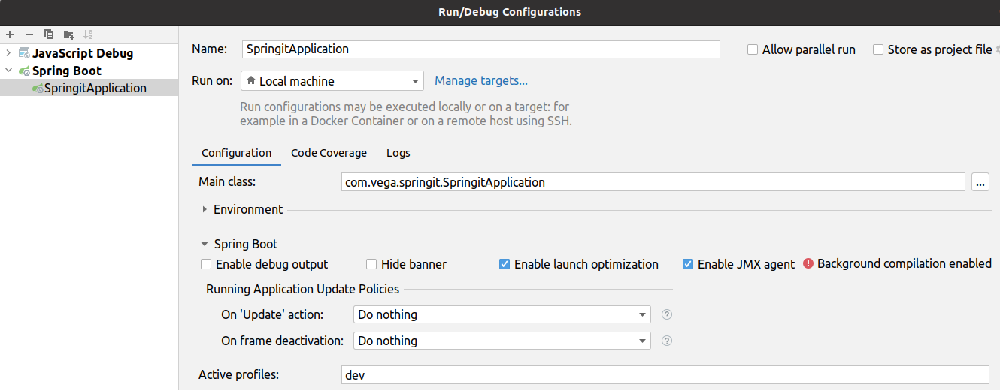

# The reddit clone - study project

This is a Reddit clone built using Spring Boot 2, Spring Framework 5,
Spring Data JPA, Spring Security, Hibernate Validation, MySQL, Thymeleaf, Bootstrap.
The project was built during the course [Getting Started with Spring Boot 2](https://www.udemy.com/course/spring-boot-2/).

## Getting Started

To launch the app define the active profile as 'dev' in IDE's Run/debug configuration.



To test the account activation process install and launch MailDev on your local machine.

```
$ npm install -g maildev
$ maildev
```
You will receive emails at http://localhost:1080.

